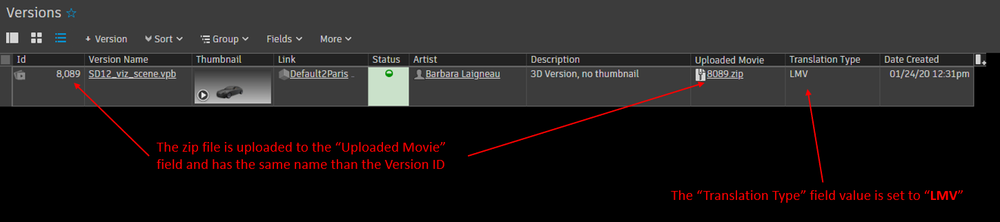

The Shotgun LMV Framework
######################################

With the introduction of the 3D Viewer inside Shotgun, we have now the possibility to review
3D files directly inside the web interface. Unfortunately, reviewing a 3D file is not so simple:
we cannot upload the file itself but a zip file containing all the dependencies needed by the
viewer.

The Shotgun LMV Framework contains a collection of helpers and tools to make it easy and
painless to build this zip package.

Once the zip package is built, it must be uploaded to Shotgun using the ``sg_uploaded_movie``
field and the ``sg_translation_type`` must be set to **LMV**.

.. warning::
    The zip file should be named after the Version ID for the 3D Viewer to be able to
find the media file.

.. warning::
    For now, only these file formats are compatible with the LMV translation:
        * .wire
        * .igs
        * .CATPart
        * .stp
        * .jt
        * .fbx
        * .vpb

Contents:

.. toctree::
   :maxdepth: 2

   translator